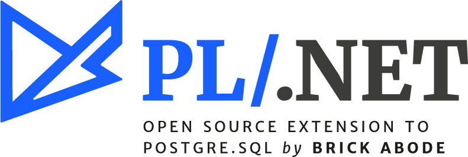

#+Title: PL/.NET

* Introduction

 PL/.NET a.k.a (*pldotnet*) adds Microsoft's .NET framework to PostgreSQL by
introducing both the C# and F# as loadable procedural language.

 Using PL/.NET developers can enjoy all benefits from .NET and its powerful
application development environment to write code near the database using cool
languages like C#. We at [[http://www.brickabode.com][Brick Abode]] love
strongly-typed functional programming and as so we are also working to support
F# for writting PostgreSQL functions and triggers in *pldotnet*
(check Future Plans and F# sample).

PL/.NET is an open source project developed by
[[http://www.brickabode.com][Brick Abode]]. You are welcome!

* Documentation

- [[/documentation/installation.org][Installation]]
- [[/documentation/examples.org][Examples]]
- [[./documentation/types-support.org][Types Support]]

* Future Plans
  - Arrays
    + Add array support for plcsharp. Beta version.
  - Composites
    + Add composites support for plcsharp. Beta version.
  - SPI
    + Add support to the PostgeSQL SPI (Server Programming API) enabling query/plans and database access. Beta version.
  - Triggers
    + Add trigger writing support in plcsharp. Beta version.
  - F#
    + Basic data types
      * Expand F# basic types support. Beta version.
    + F# Compiler Services
      * Add [[http://fsharp.github.io/FSharp.Compiler.Service/][F# Compiler Services]] API for performance improvement regarding source code compilation.
  - Additional data types
    + Add other data types support for F# and C#, like:
      * *binary*
      * *timezone*
      * *json*
      * *range*
      * *geometry*
      * *internet*
      * *bitstring*

* License

PL/.NET uses [[https://www.apache.org/licenses/LICENSE-2.0][Apache 2.0]] license.
