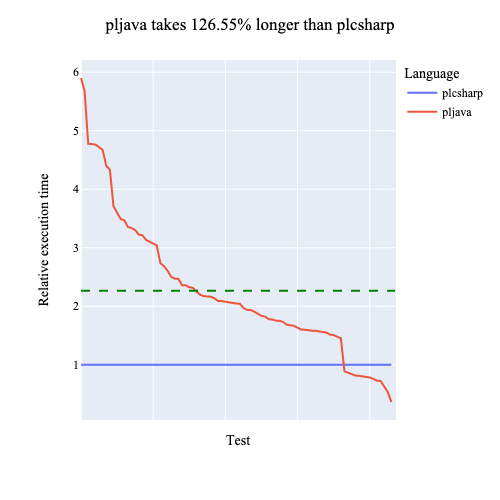
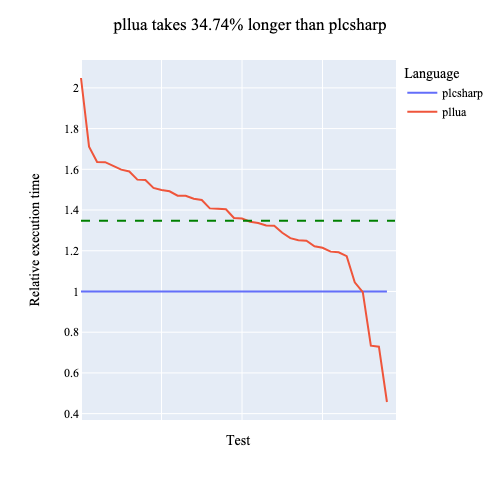
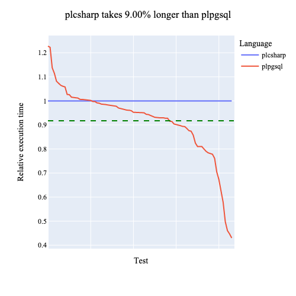
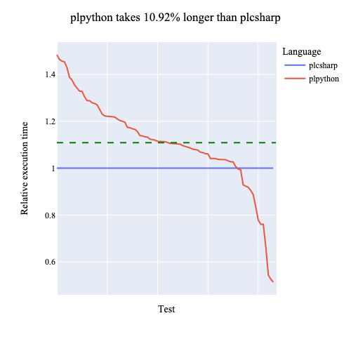
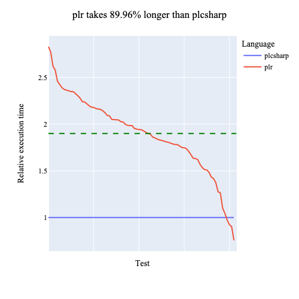
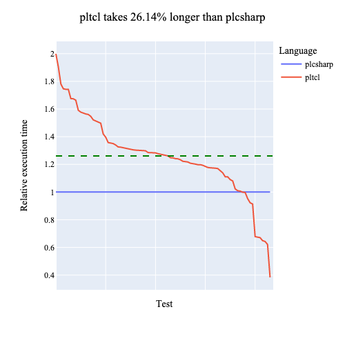

#+TITLE: The pl/dotnet Extension to PostgreSQL
#+DATE: Sun Sep 11 21:05:56 -03 2022

* Introduction

PostgreSQL is an extensible, open-sourced object-relational database
management system.  [fn:: [[https://www.postgresql.org/docs/current/intro-whatis.html][PostgreSQL 14.5 Documentation, Chapter 1. What Is PostgreSQL?]]]
Dotnet (also ".NET") is an open-sourced, cross-platform development
framework including a high-performance runtime, a JIT-compiler, and
support (including cross-calling) for multiple languages, including
both C# (an object-oriented dialect of C) and F# (based on Ocaml,
an object-oriented dialect of ML.) [fn:: [[https://dotnet.microsoft.com/en-us/learn/dotnet/what-is-dotnet]["What is .NET?"]]]

The PostgreSQL project includes support for user-defined functions
to be used as stored procedures and triggers.  These can be implemented
in a number of languages, including SQL [fn:: [[https://www.postgresql.org/docs/current/plsql.html][PostgreSQL 14.5 Documentation, Chapter 43. PL/pgSQL — SQL Procedural Language]]],
C [fn:: [[https://www.postgresql.org/docs/current/xfunc-c.html][PostgreSQL 14.5 Documentation, Chapter 38.10. C-Language Functions]]],
TCL [fn:: [[https://www.postgresql.org/docs/15/pltcl.html][PostgreSQL 14.5 Documentation, Chapter 44. PL/Tcl — Tcl Procedural Language]]],
Perl [fn:: [[https://www.postgresql.org/docs/15/plperl.html][PostgreSQL 14.5 Documentation, Chapter 45. PL/Perl — Perl Procedural Language]]],
and Python [fn:: [[https://www.postgresql.org/docs/15/plpython.html][PostgreSQL 14.5 Documentation, Chapter 46. PL/Python — Python Procedural Language]]]
in the standard distribution, and Java [fn:: [[https://tada.github.io/pljava/][PL/Java: stored procedures, triggers, and functions for PostgreSQL]]],
Lua [fn:: [[https://github.com/pllua/pllua]]],
and R [fn:: [[https://github.com/postgres-plr/plr]]]
outside of the standard definition.

The pl/dotnet project extends PostgreSQL to support stored procedures
and triggers for the dotnet platform, including both C# and F#.  We
were able to achieve native representation for 38 of them, plus
their arrays, the widest range of types of any external procedural
language in PostgreSQL.  In our benchmarks we are the fastest
external procedural language in PostgreSQL. [fn:: These benchmarks
are somewhat arbitrary, merely having been designed for our own
needs, but the were not cherry picked or tuned; we built the tests
first and only benchmarked them afterwards.  It is possible that
some of our implementation choices in other languages were sub-optimal,
and we welcome corrections, but the consistency of the results
across multiple languages makes us reasonably confident in the data.
The tests are available in our repository for inspection, and we
hope to share them in more polished form for use by other PL teams.]
Work remains, especially the complete implementation of the Server
Programming Interface, but we think the initial results are very
promising, and we share them in this paper.

pl/dotnet is a free software project, licensed under v2 of the
Apache License.

* Motivation

We were motivated to add Dotnet support to PostgreSQL for several
reasons:

First, Dotnet is a great platform for building servers.  The Dotnet
runtime is perhaps the best garbage-collected, multi-threaded runtime
in the world, with good scalability and the ability to run on all
modern operating systems.  Dotnet has interesting native compilation
features.  ASP.NET [fn:: https://dotnet.microsoft.com/en-us/apps/aspnet]
is a powerful framework for building web apps.  Our company, Brick
Abode, has developed servers in this framework for many years and
is interested in the ability to run code easily and well as stored
procedures.

Second, Dotnet includes F#, a strongly-typed functional programming of the
ML family.  We are interested in the research potential of using
functional programming in a relational database environment, so we
have full support in pl/dotnet for F#, making pl/dotnet the only
stored procedure implementation for dotnet with full F# support.

Third, programmers have long used stored procedures in their architectures
for performance and security, but doing so is difficult because of
the environmental differenes between traditional programing and
database programming: managing the software development life-cycle
is difficult, calling stored procedures can be tedious, and SQL-based
stored procedure languages such as Oracle's PL/SQL [fn:: [[http://www.orafaq.com/wiki/PL/SQL_FAQ]]],
Sybase and Microsoft's T-SQL [fn:: [[https://learn.microsoft.com/en-us/sql/t-sql/language-reference?view=sql-server-ver16]]],
and IBM's SQL PL [fn:: [[https://www.ibm.com/docs/en/db2/11.1?topic=support-plsql-features]]]
often require cross-team cooperation between developers and
database administrators on the software development, creating
project overhead.  We think these problems can be solved.

Modern languages such as C# give developers tools which are in
theory sufficient to eliminate this friction and allow automated
software deployment into the database environment, creating a
seamless developer experience.

We wish this project to help make this dream a reality, allowing
developers to easily move the code to the data instead of forcing
the data to come to the code.  We think this would make the
world a better place.

* Goals

We want pl/dotnet to be among the best stored procedure languages
for PostgreSQL, and we want to help improve the overall ecosystem
within PostgreSQL for stored procedure languages.

Specific goals include:
    - complete support for all standard PostgreSQL data types
    - support for all aggregate types: ranges, arrays, sets, records
    - rich support for C# and F#, including clear and detailed compiler error messages
    - high performance
    - memory safety
    - compatibility with Npgsql, the existing dotnet PostgreSQL client library
    - limited compatibility with the csharp stored-procedure support in MS SQL Server and IBM DB/2
    - full support, via the standard Npgsql API, for calling PostgreSQL from dotnet functions via the Server Programming Interface (SPI)
    - leveraging PostgreSQL's rich security model
    - comprehensive testing
    - improve the PostgreSQL ecosystem for other procedural languages via shared testing and cooperation

* Summary of current state and future plans

For context, we first present a feature summary, both currently
supported and planned for the future.  All items in this list are
explained in more detail later in the paper.

- Current support:
    - Languages: C# and F# both fully supported
    - Datatypes: 38 PostgreSQL data types, plus their arrays
    - All data types are nullable
    - Code can be entered directly via `CREATE FUNCTION` or, alternatively, loaded from a pre-compiled assembly
    - Performance is very good in our benchmarks, surpassing all other external PL implementations
    - Testing: we have 485 unit tests; all types, plus their arrays and nulls, are unit-tested
    - Security: Code for each function is isolated in a dotnet Assembly Load Context, providing some security protection
- Future support:
    - Datatypes: some additional types to be added, including `RECORD`, enum, and multirange
    - SPI: basic SPI is working, but we want to make it 100% Npgsql-compatible
    - Triggers: we have triggers prototyped and will implement them fully
    - Set-Returning Functions: will be mapped to `IEnumerable` for both C# and F#
    - Output parameter support

* PostgreSQL support

PostgreSQL has a rich type system, with over 40 significant types
in the main distribution.  Any mapping of these types into a programming
language is going to face choices and numerous challenges about how
to map them, especially for intricate types such as datetimes.

Fortunately, there exists a widely-used mapping of PostgreSQL types
into dotnet: the Npgsql client library, which has nearly 70,000
lines of code and quite thoughtfully handles these conversions in
a responsible way that is already in widespread use.

We embraced Npgsql compatibility as our goal and leveraged it to
map the types from PostgreSQL to dotnet.  This not only accelerated
our project, but it also ensured compatibility of dotnet code
run as an external client or as an internal stored procedure.
This helps us with our strategic goal of making code mobility as
effortless for the programmer as possible.

** Data type support

pl/dotnet fully supports the following PostgreSQL data types via
exactly the same type mapping as Npgsql.  (The type names are
sometimes different in F#.)

| PostgreSQL data type | pl/dotnet data type            |
|----------------------|--------------------------------|
| BIT                  | BitArray                       |
| BOOL                 | bool                           |
| BOX                  | NpgsqlBox                      |
| BPCHAR               | string                         |
| BYTEA                | byte[]                         |
| CIDR                 | IPAddress Address, int Netmask |
| CIRCLE               | NpgsqlCircle                   |
| DATE                 | DateOlny                       |
| FLOAT4               | float                          |
| FLOAT8               | double                         |
| INET                 | IPAddress Address, int Netmask |
| INT2                 | short                          |
| INT4                 | int                            |
| INT8                 | long                           |
| INTERVAL             | NpgsqlInterval                 |
| JSON                 | string                         |
| LINE                 | NpgsqlLine                     |
| LSEG                 | NpgsqlLSeg                     |
| MACADDR              | PhysicalAddress                |
| MACADDR8             | PhysicalAddress                |
| MONEY                | decimal                        |
| PATH                 | NpgsqlPath                     |
| POINT                | NpgsqlPoint                    |
| POLYGON              | NpgsqlPolygon                  |
| TEXT                 | string                         |
| TIME                 | TimeOnly                       |
| TIMESTAMP            | DateTime                       |
| TIMESTAMPTZ          | DateTime                       |
| TIMETZ               | DateTimeOffset                 |
| UUID                 | Guid                           |
| VARBIT               | BitArray                       |
| VARCHAR              | string                         |
| XML                  | string                         |

** Ranges

pl/dotnet supports all of the range data types in PostgreSQL:

| PostgreSQL data type | pl/dotnet data type             |
|----------------------|--------------------------------|
| DATERANGE            | NpgsqlRange<DateOnly>          |
| INT4RANGE            | NpgsqlRange<int>               |
| INT8RANGE            | NpgsqlRange<long>              |
| TSRANGE              | NpgsqlRange<DateTime>          |
| TSTZRANGE            | NpgsqlRange<DateTime>          |

We skipped multirange support for the time being and intend
to add it in the future.

** Nulls and Arrays

All types in PostgreSQL are nullable by default, so our default
handling is to map parameters to the nullable type (`T?`) in dotnet,
which is similar to a `Maybe` type in Haskell.  For PostgreSQL
functions that are defined as `STRICT`, the function will not be
invoked with null values, so in that case we map the type to the
simpler `T` type.  We hope to make this behavior configurable for
the developer in the future.

All supported data types also support arrays of that type, be they
single-dimensional or multi-dimensional.  We currently do that via
the Npgsql convention of mapping them to `Array<Object>`, but that
type mapping is cumbersome compared to the slightly different
`Object[]` representation.

We hope to give developers the second option in the future, while
leaving the Npgsql handling as the default.  This approach requires
generating code for each possible array dimensionality, but since
the maximum dimensionality for PostgreSQL arrays is six, this lets
us support one array parameter with six generated functions, two
parameters with 36 generated functions, etc.  This combinatorial
explosion will generate significantly more code, and we will have
to limit the number of array parameters when using this approach,
but we think this can work nicely:

    1. that generated code will be invisible to the user and the developer,
    2. the size of the generated code, though larger, should be accceptable in the normal case,
    3. we think the developer experience can be very nice this way, and
    4. as long as the behavior is optional, then it should be harmless.

** Parameter types: IN, INOUT, OUT

pl/dotnet currently supports only parameter input, not parameter
output.  Thus, we consume both `IN` and `INOUT` parameters,
but it is not currently possible to output an `INOUT` parameter,
We silently skip `OUT` parameters.  This handling matches
the current handling in pl/python.

Dotnet supports output parameters, and we anticipate fully
supporting value output for both `INOUT` and `OUT` parameters.

** Function, Procedure, DO, Trigger

PostgreSQL has several ways that code can be invoked from a procedural
language:
    1. As a user function (`CREATE FUNCTION`), taking parameters and returning a value.
    2. As a procedure (`CREATE PROCEDURE`), taking arguments but not returning a value.
    3. As a `DO` block, creating a transient anonymous function in a procedural language.
    4. As a trigger (`CREATE TRIGGER`), which is a function called when certain database events happen.

pl/dotnet currently supports user functions, procedures, and `DO` blocks.
Triggers are partially supported but unreleased, and we anticipate
fully supporting them soon.

** Code and Assemblies are both supported

Traditional PostgreSQL procedural languages, such as pl/pgsql
and pl/python, support creating user functions by passing the
code as part of the declaration of the function.

Alternatively, PostgreSQL's pl/java, along with the dotnet (CLR)
implementations in Microsoft's SQLServer and IBM's DB2, support
loading a function from a pre-compiled assembly (`.dll`) or class file.

pl/dotnet supports both modes:

#+BEGIN_SRC sql
CREATE OR REPLACE FUNCTION IntegerTest(a INTEGER) RETURNS INTEGER AS $$
    return a+1;
$$ LANGUAGE plcsharp STRICT;
#+END_SRC

#+BEGIN_SRC sql
CREATE OR REPLACE FUNCTION IntegerTest(a INTEGER) RETURNS INTEGER
    AS 'AssemblyTest.dll:UserNamespaceTest.UserClassTest!IntegerTest'
LANGUAGE plcsharp STRICT;
#+END_SRC

PostgreSQL does have support for declaring the library from which
to load a function, but only for natively-compiled (that is, C)
functions.  For other languages, the PostgreSQL parser currently
does not pass the file location to the language handler, as it was
not an anticipated use case.  For newer language handlers like
pl/dotnet and pl/java, which also support loading code from external
libraries/classes/assemblies, this would be a nice feature for
PostgreSQL to provide.

** Future Features

PostgreSQL supports stored procedures themselves making SQL calls back
into the database via the Server Programming Interface (SPI).  We
have an initial implementation of SPI, but it is not very safe at
the moment, so we chose not to include it in the first version.

Our intention is to map SPI to a fully-conformant Npgsql connection
object, which should again maximize compatibility between code
run in a client context and code run in a stored procedure context.

We do not currently support dynamic database types, such as enums,
composites, domain types, and other user-defined types.  Npgsql
does support them, and we intend to add them in the future, but
their handling is somewhat delicate, so we chose to ship the first
version without them.

PostgreSQL supports set-returning functions (SRFs), which lazily
return a potentially-infinite set of values.  This database
functionality maps nicely to the `IEnumerable<T>` interface
in C# and `seq<'T>` in F# (which is just an alias for IEnumerable<T>.)

We have a prototype implementation of SRFs which supports returning
both finite and infinite sets and includes careful garbage collection
of the iterator.  (Especially for inifinite sets, the database must
tell you when it is done consuming values, and you then must destroy
the iterator in order not to leak memory.) We anticipate fully
supporting SRFs soon.

* Dotnet implementation

** Architecture

Any stored procedure language in PostgreSQL is going to have some
mix of C code and language-specific code, and there are choices to
be made in where and how you express functionality.  We liked the
increased safety of working in C#, and we valued the richer set of
programming tools, so our decision was to keep the C code to a
minimum and use C# wherever possible handle the transfer of data
into and out of user functions.

Every piece of data in PostgreSQL is expressed in a datum, and each
datum has an Object Identifier (OID) for its type.  (This OID is
not in the datum at runtime; it is in the type definition for the
function at compile time.) For each data type, pl/dotnet has a pair
of small C function whose purpose is to get the values out of the
datum to dotnet (called `InputValue`) and then back from dotnet
into the datum (called `OutputValue`.)  All of the remaining handling
is then done in C#; this includes dotnet type conversions, arrays,
and null handling.  This also has the nice effect of keeping both
C code and unsafe C# code to a minimum; they are strictly limited
to getting data into and back out of dotnet.

When a function is created, pl/dotnet creates two assemblies: the
UserHandler, and the UserFunction.  The UserFunction is just a
wrapper around the user's code, or in cases where the user has
loaded the function from a pre-compiled assembly, then it is just
that assembly.  The UserHandler is responsible for marshalling
values out of the database, calling the UserFunction, and then
returning the result values back into the database.

A nice feature of this architecture is that, because the UserHandler
is so cleanly separated from the UserFunction, support for pre-compiled
DLLs was straightforward.  Further, it made adding F# support to
pl/dotnet easy, because we can reuse the C# implementation of the
UserHandler and need only compile the UserFunction in F#, which is
then easily callable from C#.

Adding other dotnet languages would be similarly easy, and if someone
would like to pay us a sufficient quantity of money, then we would
be willing to add Visual Basic support, but otherwise such support
is not currently planned.

When a function is called from PostgreSQL, C builds an array of
datums with the function arguments and passes them to C#.  C# knows the type of each argument
from when the function was created, and it calls the corresponding
handlers for each type to convert it from a PostgreSQL datum to a
dotnet value.  The C# handler is where NULL and array handling are
implemented, which is nicely generic.

After those values have been passed to the user function, the
return value follows the reverse path through the type handler
to create a PostgreSQL datum, which is then returned to the
database.

** Compilation and caching

Both C# and F# make use of a template file which is then customized.
Users can optionally inspect the generated code.

pl/dotnet uses the the .NET Compiler Platform SDK, aka Roslyn
[fn:: [[https://learn.microsoft.com/en-us/dotnet/csharp/roslyn-sdk/]]] [fn:: [[https://github.com/dotnet/roslyn]]],
which are a set of compiler tools to compile C# to an in-memory
assembly.  Roslyn exposes the entire compiler pipeline to the
application, providing flexibility when compiling
user functions such as:

    - extensive code checking
    - informative error messages, including correct line numbers
    - ability to rewrite the code in the AST if needed
    - code inspection, including metadata
    - fine-grined control over library availability

We use F# Compiler Services (FCS)[fn::
https://fsharp.github.io/fsharp-compiler-docs/fcs/]  in a similar
way to dynamically compile F# user functions into an assembly.  
For historical reasons, the facilities offered by FCS are not
identical to Roslyn, but they are generally comparable.

The generated code is then compiled into in-memory assemblies. If
a pre-compiled assembly/DLL has been used, then that is loaded
alongside the generated UserHandler.  For F#, we support doing this
with both dynamic assemblies and normal assemblies.  These assemblies
are loaded into an Assembly Load Context, which provides limited
isolation of one function from another and also from the core system.

The resulting assembly context is then cached for reuse on subsequent
calls.  If the function has been dropped from the cache, either by
a cache replacement or by a database restart, then we will transparently
re-compile the function the next time that it is called.

** Strings

pl/dotnet currently assumes that all PostgreSQL strings are encoded
in utf8, which is a superset of ASCII.  We are interested in extending
our support for alternative character encodings, but utf8 is the
de facto standard today, and alternative encodings are merely of
historical interest, so this functionality is not urgent.

Dotnet spans let you create an object from only a pointer and a
length, leaving the contents where they lay rather than requiring
that they be copied[fn::
[[https://learn.microsoft.com/en-us/dotnet/standard/memory-and-spans/]]].
Strings in pl/dotnet are handled via a `ReadOnlySpan`, which is
inexpensive and generally a very nice interface.

Strings then have to be converted between the utf8 of PostgreSQL
and the utf16 of dotnet, and this is not so nice.[fn::
[[https://learn.microsoft.com/en-us/dotnet/standard/base-types/character-encoding-introduction]]]

utf16 strings are, as you might guess from the name, generally twice
as long as utf8 strings, and having to convert them on entry to and
exit from dotnet is unavoidably costly.  Like other dotnet users
outside of the Windows ecosystem, we would love to see dotnet
switched to use utf8 encoding, or at least better support hybrid
use of utf8 strings, only doing the conversion to utf16 when it is
necessary; for our use case, most strings would not need to be
converted, and this would return a nice performance savings
to the system.

However, we understand why utf16 is historically necessary in dotnet,
and we understand why mixed utf8/utf16 usage inside of dotnet could
present significant difficulties.  We welcome the advances in this
direction in recent years and hope that it continues.

Fortunately, our benchmarks show that the computational cost of
string conversion is not onerous.

* Platform support

** Operating systems and CPU

pl/dotnet is developed on Linux and has been fully tested on both
x86 and ARM CPUs, hopefully ensuring the absence of endianness bugs.

Our build environment is container-based, allowing us a stable and
repeatable build environment.  We build on Bullseye [fn:: Ride like
the wind, Bullseye!], version 11 of the Debian Linux distribution.
We use the system dpkg versions of both dotnet and PostgreSQL.  We
build, install, and test a standard debian package ("dpkg").

We would like for pl/dotnet to work on both Windows and macOS, and
given that we have few system dependencies in the code, and those
are very standard, we do not anticipate any significant problems
in doing so.  However, given that most PostgreSQL usage is on Linux,
we decided that prioritizing Linux support and leaving the other
platforms until later made sense; our focus for now is on growing
the system's functionality, not expanding its range of support.

We welcome code contributions to support pl/dotnet on other
Linux distributions and on other operating systems.

** Postgresql versions

We support PostgreSQL versions 10, 11, 12, 13, 14, and 15.
Currently, all features are supported for all PostgreSQL
versions, and the only anticipated exception to that support
is multirange, which was added in PostgreSQL v14, and which
we intend to add support for soon.

** Dotnet versions

We currently develop against dotnet version 6 and 7.  Support for
older versions of dotnet would not be difficult, but we currently
have no need for it.

* Security

Security in pl/dotnet is limited.  We use separate Assembly Load Contexts
[fn:: [[https://learn.microsoft.com/en-us/dotnet/api/system.runtime.loader.assemblyloadcontext?view=net-7.0]]]
for each stored procedure, which provides some level of isolation
between them: they exist in separate namespaces and generally
do not have access to each other's code or data, or that of
the underlying system.

Thus, there is no straightforward way for stored procedures to
interfere with PostgreSQL, but it might be possible to do so with
not-straightforward paths.  We could marginally improve the security
of the system by reducing the set of libraries available to
stored procedures, but even this would not be a guarantee.

Microsoft previously attempted to provide these guarantees in
dotnet with AppDomain
[fn:: [[https://learn.microsoft.com/en-us/dotnet/core/porting/net-framework-tech-unavailable]]]
but eventually gave up and (rightly) deprecated it.  The number
of potential avenues of attack are simply too great to be able
to secure with sufficient certainty unless the platform is designed
from the ground up to provide such security, and almost no modern
language runtimes were engineered in that way.

This problem is faced by every stored procedure language, and unless
the language provides air-tight guarantees as to its security, then
we think that skepticism regarding such assurances is warranted.
Few languages provide such guarantees, and we do not think that any
of the current stored procedure languages qualify; only pl/tcl even
makes such a claim, and while we respect their design, we would
still probably not fully trust it for security-critical usage.

The fundamental problem is that stored procedures are executing
inside of the PostgreSQL server's memory space, and the operating
system and CPU provide no memory protection between the stored
procedures and the database.  This is the fundamental tradeoff to
be made in order to get the increased performance which stored
procedures provide.

Even with these limitations, we think there is a security argument
to be made for this approach.  In the normal use case, database
clients cannot easily interfere with PostgreSQL's internal operation,
but they have access, usually unrestricted, to modify or delete the
data; PostgreSQL's integrity is only important insofar as it serves
to protect the data, and if the data is not protected, because the
client has full priviliges, the inability to subvert PostgreSQL is
irrelevant anyway.

It is generally easier to subvert the security of a client process,
for example in a public-facing web server, than it is to subvert
the security of the database or the stored procedures which it
holds.  By trusting a limited set of code inside of the database,
it should be possible to dramatically limit the trust one needs to
extend to the database client (the web server), and this often will
be an improvement in overall security, sometimes a dramatic one.

Stored procedure authors should, as always, take care that their
code not introduce means to be subverted by malicious input.
This is easier in a memory-safe environment like dotnet.

Security-critical applications do exist, and we are interested in
serving them.  If we do so, then it will be via a sidecar, a separated
operating system process context with full memory protection, using
message passing or shared memory to communicate to the database
server on the same host operating system.  Unless and until such a
system is built, we recommend thoughtful evaluation of whether the
security of the current system is appropriate to your application.
For most current applications, we think that it should be.

* Testing, Static Analysis, and Documentation

We have built unit tests for all supported datatypes, their arrays,
and null handling in C#.  We currently test a limited but representative
range of datatypes in F# and anticipate extending that test support
to full coverage in the future.

We use three static analysis tools:
1. Cpplint[fn:: https://github.com/cpplint/cpplint] is a static code
   checker for C and C++.
2. StyleCop[fn:: https://github.com/DotNetAnalyzers/StyleCopAnalyzers]
   is a static code analysis tool.  Formerly a standalone tool, it was
   refactored to become a series of Roslyn plugins.
3. SonarLint [fn:: https://rules.sonarsource.com/csharp] is a code
   quality and security static analysis tool with almost 5000 rules.

C and C# code in pl/dotnet is clean under the cpplint, StyleCop, and
SonarLint checks.

Source code in pl/dotnet, both C and C#, is documented using Doxygen,
and the generated documents are reasonably complete in explaining
the system.

* Comparison (and cooperation) with other PSQL Procedural Languages

We have built automated testing for over a hundred features across
a range of other PostgreSQL procedural languages:

| language     | # tests |
|--------------|---------|
| v8javascript | 109     |
| python       | 118     |
| perl         | 110     |
| r            | 105     |
| java         | 115     |
| lua          | 102     |
| tcl          | 108     |
| pgsql        | 109     |

We hope to assemble these tests into a unified suite which can be
used by the entire PostgreSQL PL community.  We hope that this can
help us all improve performance, improve cooperation across the PL
space, and help us work together to drive improvement in PostgreSQL
to support the PL implementations.

** Performance

We used these tests for benchmarking pl/dotnet.  We will now present
these results.

It is important first to say that these benchmarks were not intended
to fairly (or unfairly) evaluate the performance of other languages.
Rather, they were intended to help us explore other languages'
handling of PostgreSQL datatypes, understand pl/dotnet's performance,
and find our own problems.  They cover a wide range of stored
procedure types and functionality, but they are not intended (and
probablly cannot be) representative of the actual performance
experienced by users, which will of course depend on the particular
features which they use.  We merely built the tests we needed for
comparison, ran them, and benchmarked pl/dotnet's performance against
them.

Under these tests, pl/dotnet's performance compared to the other
procedural languages was good.  We think it was especially good
considering that we have not yet performed any optimizations; we
believe that we can make significant improvements.

To compute total performance, we equally weighted each test and
compared pl/dotnet against the other PL in question.  First, a
summary:

| Language   | Execution time relative to pl/dotnet |
|------------|--------------------------------------|
| plpgsql    |   91.74%                             |
| plperl     |  108.60%                             |
| plpython   |  110.92%                             |
| pltcl      |  126.14%                             |
| pllua      |  134.74%                             |
| plr        |  189.96%                             |
| pljava     |  226.55%                             |

Second, some graphs showing the relative performance:

As you can see, pl/dotnet is faster than every other PL, with the
exception of pl/pgsql.  pl/pgsql has always been the fastest language
in PostgreSQL, because its native datatype representation is the
PostgreSQL representation, so it does not need to perform any data
conversions.  We are pleased that our performance against it is so
relatively strong; we would love to achieve overall parity with it.

Across all language comparisons, there are a small number of tests
where pl/dotnet is significantly worse, and these are the array
tests.  This is caused, we believe, by the Npgsql object representation
of variably-dimensioned arrays; more investigation is required to
confirm this speculation.

The fact that PostgreSQL enforces neither the specified array size
nor the specified array dimension is very unfortunate for languages
like C# which feature very fast array support but which, in the
absence of fixed dimensionality, must fall back on cubersome object
representations even for the common case of a single-dimensional
array.

As mentioned previously, we have thoughts for how we can improve
this in pl/dotnet.  Further, PostgreSQL could (and in our opinion
should) be updated to enforce the functional specification of array
dimension.

For the time being, our goal remains 100% Npgsql compatibility, and
we are willing to suffer the moderate performance impact of its
array handling in order to preserve the greater goal of code mobility.
Any performance enhancements along these lines in the future will
be optional, with the default behavior remaining Npgsql-compatibile.

** Type support

Numerous of the PL implementations for scripting languages, such
as pl/python and pl/tcl, achieve type support by passing the
PostgreSQL string representation to their functions for most or all
data types.  This nominally achieves full type support, but at the
cost of pushing ambiguity and processing cost onto the developer,
as well as significant run-time overhead.

pl/dotnet and pl/java map PostgreSQL values into their platform's
corresonding native type.  Here, we were greatly aided by the
existence of Npgsql, which already has extensive mapping of the
PostgreSQL type system to the dotnet type system.  Leveraging their
work, we are able to have the greatest range of native type support
of any external procedural language in PostgreSQL.

We still have some minor gaps in our type coverage, including
`RECORD`, enum, and multirange.  We hope to be the first external
PL with 100% native support of all PostgreSQL user types, and we
continue to work in that direction.

* Conclusion

We think pl/dotnet is an interesting contribution to the PostgreSQL
and dotnet ecosystems.  We hope that developers will find it useful.
We welcome feedback on the project, and we look forward to improving
it.

We thank the authors of dotnet, PostgreSQL, and Npgsql for their work,
without which this project would not be possible.
